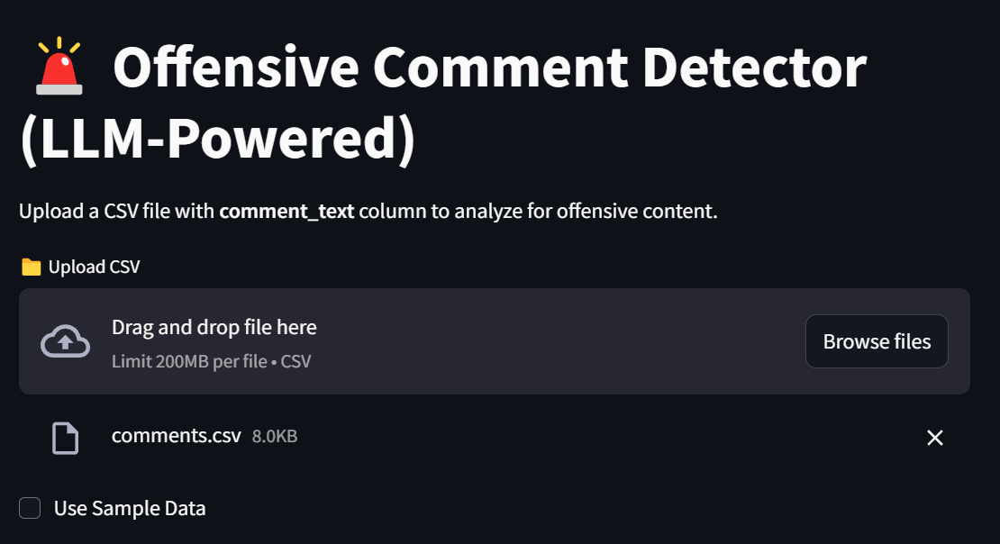
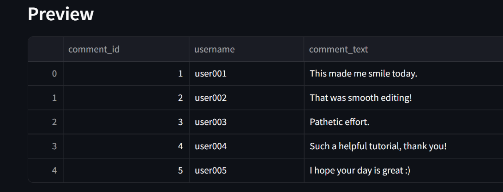
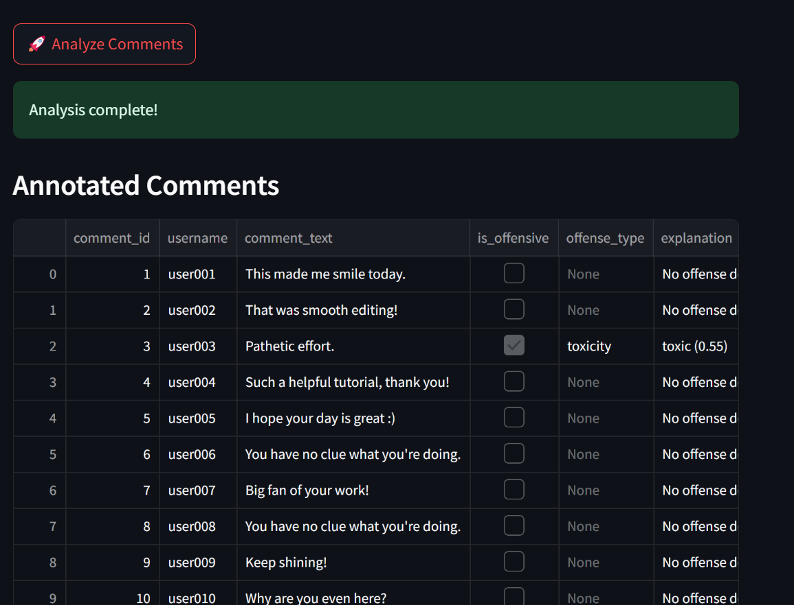
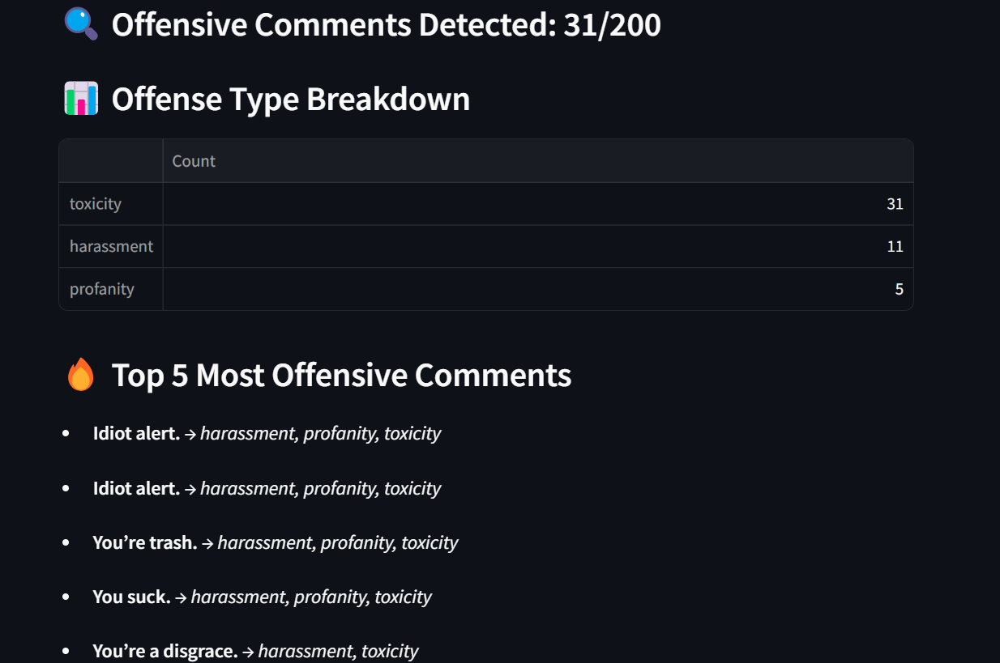
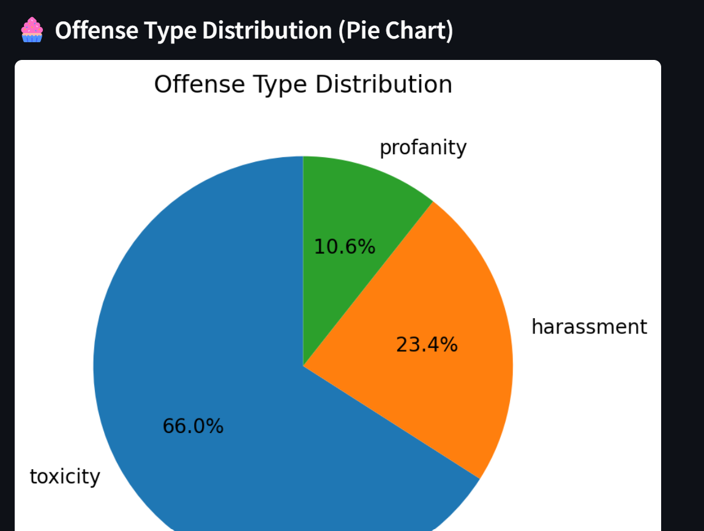

# 🛡️ Offensive Comment Detector (LLM-Powered)

🔗 **[Live Demo](https://offensive-comment-detector-eevkxsnrpibk6qxufebdkt.streamlit.app/)** — 🚀 **Click here to test the app instantly in your browser**  
🌐 `https://offensive-comment-detector-eevkxsnrpibk6qxufebdkt.streamlit.app/`

---

## 📌 Overview

This repository provides a **Streamlit-based web application** that detects **offensive, toxic, or hateful comments** using a **BERT-based LLM classifier**. Upload a CSV file or try sample data to analyze text for various types of harmful language and receive insights with visualizations.

## 🛠 Features

**✅ Real-time Comment Analysis**  
- Supports input via CSV or sample data.  
- Detects **toxicity**, **hate speech**, **profanity**, **harassment**, and more.

**✅ Multi-label Classification**  
- Uses `unitary/toxic-bert` transformer model.  
- Applies **custom thresholds** to determine offense severity.

**✅ Streamlit UI**  
- Clean interface to upload files, visualize results, and download annotated data.

**✅ Explanation & Score**  
- Highlights offensive categories with confidence scores.

**✅ Insightful Analytics**  
- Pie chart of offense types.  
- Top 5 most offensive comments shown.  
- Offense category breakdown.

---


## 🚀 Installation & Setup

### 1️⃣ Clone the Repository

```bash
git clone https://github.com/your-username/offensive-comment-detector.git
cd offensive-comment-detector
```

---

### 2️⃣ Create Virtual Environment & Install Dependencies

```bash
python -m venv venv

# For Windows
venv\Scripts\activate

# For macOS/Linux
source venv/bin/activate

pip install -r requirements.txt
```

---

### 3️⃣ Launch the Streamlit App

```bash
streamlit run main.py
```

---
## 📷 Screenshots

### 1️⃣ Open the Streamlit App from CLI  
[🔗 Streamlit Link](https://offensive-comment-detector-eevkxsnrpibk6qxufebdkt.streamlit.app/)  
Launch the app and either upload your own file or use the sample data.  
Click on **Use Sample Data**.



---

### 2️⃣ Preview of Sample Data  
Once the data is loaded, you can preview the first few rows.



---

### 3️⃣ Click "🚀 Analyze Comments"  
After previewing the data, click on the **Analyze Comments** button and wait for the model to process.



---

### 4️⃣ Analysis Output  
The app will display annotated comments along with offense type and explanations.



---

### 5️⃣ Pie Chart Visualization  
A pie chart visualizes the distribution of different offense types in the analyzed data.


